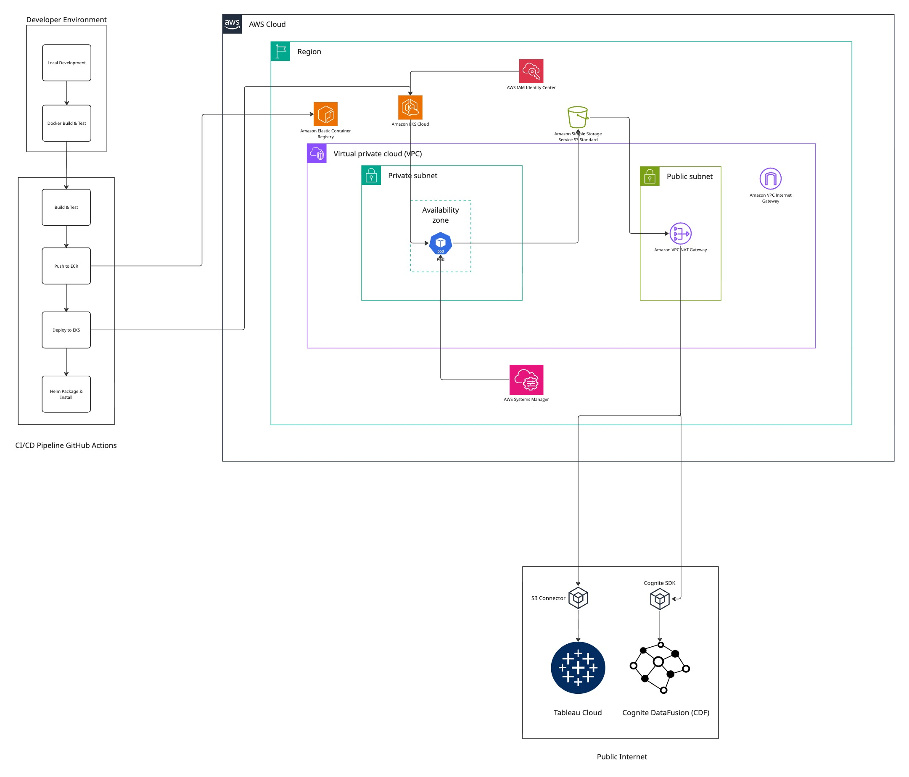

# CDF S3 Replicator

The **CDF S3 Data Modeling Replicator** utilizes the **Cognite Data Fusion** (CDF) APIs to stream Data Modeling instances to **Amazon S3** in Delta Lake format, optimized for analytics and BI tools.

## Table of Contents
- [Overview](#overview)
- [Architecture](#architecture)
- [Prerequisites](#prerequisites)
- [Local Development](#local-development)
  - [Installation](#installation)
  - [Environment Variables](#environment-variables)
  - [Configuration File](#configuration-file)
  - [Running Locally](#running-locally)
- [Building and Testing](#building-and-testing)
  - [Docker Build](#docker-build)
  - [Running Tests](#running-tests)
- [Production Deployment on AWS](#production-deployment-on-aws)
  - [Infrastructure Components](#infrastructure-components)
  - [Deployment Steps](#deployment-steps)
  - [CI/CD Pipeline](#cicd-pipeline)
- [Configuration Management](#configuration-management)
  - [Data Model Configuration](#data-model-configuration)
  - [Performance Tuning](#performance-tuning)
  - [Remote Configuration](#remote-configuration)
- [Connecting BI Tools](#connecting-bi-tools)
  - [Tableau Integration](#tableau-integration)
  - [Power BI](#power-bi)
  - [Other Tools](#other-tools)
- [Operations and Maintenance](#operations-and-maintenance)
  - [Monitoring](#monitoring)
  - [Troubleshooting](#troubleshooting)
  - [State Management](#state-management)
  - [Backup and Recovery](#backup-and-recovery)
- [Security](#security)
- [Cost Optimization](#cost-optimization)
- [Testing](#testing)
  - [Unit Tests](#unit-tests)
  - [Integration Tests](#integration-tests)
- [Migration from Previous Versions](#migration-from-previous-versions)
- [API Reference](#api-reference)
- [Contributing](#contributing)
- [Support](#support)

## Overview

The CDF S3 Data Modeling Replicator streams data from Cognite Data Fusion (CDF) Data Modeling spaces to Amazon S3, providing:

- **Incremental sync** with cursor-based change detection and automatic recovery
- **Versioned data models** with explicit version tracking in S3 paths
- **Tableau-optimized publish layer** with stable Parquet files for BI consumption
- **Automatic schema evolution** handling type changes without data loss
- **AWS IAM role integration** for secure, credential-free S3 access in production
- **Remote configuration** via CDF extraction pipelines for easy updates
- **State management** in CDF RAW for resumable syncs

The replicator maintains checkpoints in CDF's RAW storage, allowing it to be stopped and restarted without data loss, always picking up where it left off.

## Architecture

### System Architecture

```
┌─────────────────────────────────────────┐
│         CDF Data Modeling API           │
│  (Spaces, Models, Views, Instances)     │
└────────────────┬────────────────────────┘
                 │ Sync API
                 ↓
┌─────────────────────────────────────────┐
│       CDF S3 Replicator Service         │
│  ┌─────────────────────────────────┐    │
│  │ DataModelingReplicator          │    │
│  │ - Cursor Management              │    │
│  │ - Schema Evolution               │    │
│  │ - Delta Lake Writer              │    │
│  └─────────────────────────────────┘    │
└────────────────┬────────────────────────┘
                 │ IAM Role (in AWS)
                 ↓
┌─────────────────────────────────────────┐
│            Amazon S3                    │
│  ┌─────────────────────────────────┐    │
│  │ Raw Layer (Delta Tables)        │    │
│  │ - Incremental updates           │    │
│  │ - Full history                  │    │
│  ├─────────────────────────────────┤    │
│  │ Publish Layer (Parquet)         │    │
│  │ - Deduplicated snapshots        │    │
│  │ - Tableau-optimized             │    │
│  └─────────────────────────────────┘    │
└─────────────────────────────────────────┘
                 ↓
         ┌───────────────┐
         │   BI Tools    │
         │ (Tableau, etc)│
         └───────────────┘
```

### S3 Data Structure
```
s3://your-bucket/prefix/
├── raw/                                    # Incremental updates in Delta format
│   └── <space>/
│       └── <model_external_id>/
│           └── <version>/                  # Explicit version number
│               └── views/
│                   ├── <view_name>/
│                   │   ├── nodes/          # Delta table with node instances
│                   │   │   ├── _delta_log/
│                   │   │   └── *.parquet
│                   │   └── edges/          # Delta table with edge instances
│                   │       ├── _delta_log/
│                   │       └── *.parquet
│                   └── _edges/             # Edge-only views
│                       ├── _delta_log/
│                       └── *.parquet
└── publish/                                # Deduplicated snapshots for BI tools
    └── <space>/
        └── <model_external_id>/
            └── <version>/
                └── <view_name>/
                    ├── nodes.parquet       # Latest deduplicated nodes
                    └── edges.parquet       # Latest edges
```

### AWS Infrastructure (Production)
```
AWS Account
├── Secrets Manager
│   └── /org/cdf-s3-replicator/runtime     # CDF credentials
├── ECS Fargate
│   ├── Cluster: cdf-s3-replicator
│   ├── Service: cdf-s3-replicator
│   └── Task Definition
│       ├── IAM Task Role                  # S3 access without credentials
│       ├── Container: cdf-s3-replicator
│       └── Environment Variables
├── ECR
│   └── Repository: cdf-s3-replicator      # Docker images
├── CloudWatch
│   ├── Log Group: /org/cdf-s3-replicator
│   └── Metrics & Alarms
└── S3
    └── Bucket: your-data-bucket           # Delta Lake tables
```

## Prerequisites

### CDF Requirements
- **CDF project** with Data Modeling enabled
- **Extraction pipeline** created for remote configuration
- **Service principal** with the following capabilities:
  - `dataModels:read` - Read data model definitions
  - `dataModelInstances:read` - Query instances from views
  - `raw:read`, `raw:write` - Manage state store
  - `extractionPipelines:read` - Read remote configuration (optional)

### AWS Requirements
- **AWS account** with appropriate IAM permissions
- **S3 bucket** for storing Delta Lake tables
- For production deployment:
  - VPC with private subnets and NAT gateway
  - ECS Fargate or EC2 capacity

### Local Development Requirements
- **Python** 3.10, 3.11, or 3.12
- **Poetry** for dependency management
- **Docker** for containerization
- **AWS CLI** configured with credentials

### Production Deployment Requirements
- **Pulumi CLI** for infrastructure as code
- **Node.js** 18+ for Pulumi TypeScript
- **AWS CLI** with appropriate permissions

## Local Development

### Installation

1. **Clone the repository**:
```bash
git clone https://github.com/cognitedata/cdf-s3-replicator.git
cd cdf-s3-replicator
```

2. **Install Python** (3.10, 3.11, or 3.12):
```bash
# Using pyenv (recommended)
pyenv install 3.12.0
pyenv local 3.12.0
```

3. **Create virtual environment**:
```bash
python -m venv .venv
source .venv/bin/activate  # On Windows: .venv\Scripts\activate
```

4. **Install dependencies**:
```bash
pip install -e ".[dev]"
# Or using uv:
uv venv
source .venv/bin/activate  # On Windows: .venv\Scripts\activate
uv pip install -e ".[dev]"
```

### Environment Variables

Create a `.env` file in the project root:

```bash
# ===== Environment Configuration =====
APP_ENV=  # Options: For development: dev, or development. For production: prod, or production

# ===== CDF Configuration =====
COGNITE_BASE_URL=https://your-cluster.cognitedata.com
COGNITE_PROJECT=your-project-name
COGNITE_CLIENT_ID=your-client-id
COGNITE_CLIENT_SECRET=your-client-secret
COGNITE_TOKEN_URL=https://login.microsoftonline.com/<tenant-id>/oauth2/v2.0/token
COGNITE_TOKEN_SCOPES=https://your-cluster.cognitedata.com/.default

# ===== State Storage in CDF RAW =====
COGNITE_STATE_DB=s3_replicator_state      # Database in CDF RAW
COGNITE_STATE_TABLE=data_modeling_state   # Table for sync state
COGNITE_EXTRACTION_PIPELINE=s3-data-modeling-replicator

# ===== AWS S3 Configuration =====
AWS_S3_BUCKET=your-bucket-name
S3_PREFIX=cdf-data/                       # Optional path prefix
AWS_REGION=us-east-1

# ===== AWS Credentials (LOCAL DEVELOPMENT ONLY) =====
# These are NOT needed in AWS deployment (uses IAM roles)
AWS_ACCESS_KEY_ID=
AWS_SECRET_ACCESS_KEY=
```

### Configuration File

Create `config.yaml` with your data modeling configuration:

```yaml
# Logging configuration
logger:
  console:
    level: INFO  # Options: DEBUG, INFO, WARNING, ERROR

# CDF connection settings
cognite:
  host: ${COGNITE_BASE_URL}
  project: ${COGNITE_PROJECT}

  idp-authentication:
    token-url: ${COGNITE_TOKEN_URL}
    client-id: ${COGNITE_CLIENT_ID}
    secret: ${COGNITE_CLIENT_SECRET}
    scopes:
      - ${COGNITE_TOKEN_SCOPES}

  # Optional: extraction pipeline for remote config
  extraction-pipeline:
    external-id: ${COGNITE_EXTRACTION_PIPELINE}

# Extractor settings
extractor:
  state-store:
    raw:
      database: ${COGNITE_STATE_DB}
      table: ${COGNITE_STATE_TABLE}

  # Sync intervals
  poll-time: 900               # Seconds between sync cycles (15 min)
  snapshot-interval: 900       # Seconds between publish snapshots (15 min)

  # Batch sizes for performance tuning
  subscription-batch-size: 10000    # Instances per query
  ingest-batch-size: 100000        # Instances per batch
  s3-ingest-batch-size: 1000       # Rows per S3 write

# Data models to replicate
data_modeling:
  # Example 1: Sync specific model (latest version, all views)
  - space: analytics-space
    data_models:
      - external_id: CustomerModel

  # Example 2: Sync specific version and views
  - space: test-space
    data_models:
      - external_id: TestModel
        version: "2"
        views: [CustomerView, OrderView, ProductView]

# S3 destination configuration
destination:
  s3:
    bucket: ${AWS_S3_BUCKET}
    prefix: ${S3_PREFIX}       # Optional: prefix for all objects
    region: ${AWS_REGION}
```

### Running Locally

#### Using Python directly
```bash
python -m cdf_s3_replicator config.yaml
```

#### Using Docker
```bash
# Build image
docker build --no-cache -f build/Dockerfile -t cdf-s3-replicator:latest .

# Run container
docker run --rm --env-file .env cdf-s3-replicator:latest
```

#### Expected Output
```
2024-01-15 10:00:00 INFO: Starting CDF S3 Replicator
2024-01-15 10:00:01 INFO: Processing space: production-space
2024-01-15 10:00:02 INFO: Syncing CustomerModel version 1
2024-01-15 10:00:05 INFO: Writing to s3://your-bucket/cdf-data/raw/production-space/CustomerModel/1/views/CustomerView/nodes
2024-01-15 10:00:45 INFO: Cycle finished in 45.2s - sleeping 855s
```

#### Using Docker
```bash
# Unit tests
pytest tests/unit/ -v

# Integration tests (requires test environment)
pytest tests/integration/ -v

# Coverage report
coverage run --source cdf_s3_replicator -m pytest tests/unit/
coverage report
coverage html  # Creates htmlcov/index.html
```

### Open the HTML coverage report
```bash
macOS: open htmlcov/index.html
Linux: xdg-open htmlcov/index.html
Windows: start htmlcov\index.html
```

## Building and Testing

### Docker Build

Build the Docker image:
```bash
docker build -t cdf-s3-replicator:latest -f Dockerfile .

# For specific platform
docker build --platform linux/amd64 -t cdf-s3-replicator:latest .

# With build arguments
docker build \
  --build-arg PYTHON_VERSION=3.12-slim \
  -t cdf-s3-replicator:latest .
```

### Running Tests

#### Unit Tests
```bash
# Run all unit tests
pytest tests/unit/

# Run with coverage
coverage run -m pytest tests/unit/
coverage report

# Run specific test file
pytest tests/unit/test_data_modeling.py

# Run with verbose output
pytest -v tests/unit/
```

#### Integration Tests
```bash
# Set test environment variables
export TEST_CONFIG_PATH=tests/integration/test_config.yaml
export COGNITE_CLIENT_NAME=cdf-s3-replicator-tests

# Run integration tests
poetry run pytest tests/integration/

# Run specific integration test
poetry run pytest tests/integration/test_data_modeling_integration.py
```

#### Test Coverage Requirements
- Minimum coverage: 60%
- Focus on unit test coverage for individual functions
- Integration tests for end-to-end workflows

## Production Deployment on AWS

### Infrastructure Components

#### 1. Secrets Management (`infra/platform/secrets/`)

Stores CDF credentials securely in AWS Secrets Manager.

**Directory structure**:
```
infra/platform/secrets/
├── index.ts          # Secrets Manager resources
├── Pulumi.yaml       # Project configuration
├── Pulumi.prod.yaml  # Production stack config
├── package.json      # Node dependencies
└── deploy.sh         # Deployment script
```

#### 2. Application Assets (`infra/platform/application-assets/`)

Creates ECR repository, S3 buckets, and CloudWatch logs.

**Directory structure**:
```
infra/platform/application-assets/
├── index.ts          # ECR, S3, CloudWatch resources
├── Pulumi.yaml       # Project configuration
├── Pulumi.prod.yaml  # Production stack config
├── package.json      # Node dependencies
└── deploy.sh         # Deployment script
```

#### 3. Application Deployment (`infra/application/`)

Deploys the container to ECS Fargate with IAM roles.

**Directory structure**:
```
infra/application/
├── index.ts          # ECS Fargate deployment
├── Pulumi.yaml       # Project configuration
├── Pulumi.prod.yaml  # Production stack config
├── package.json      # Node dependencies
└── deploy.sh         # Deployment script
```

### Deployment Steps

#### Step 1: Prerequisites

```bash
# Install Pulumi
curl -fsSL https://get.pulumi.com | sh
export PATH=$PATH:$HOME/.pulumi/bin

# Configure AWS CLI
aws configure
# Or use IAM role if deploying from EC2/CloudShell

# Login to Pulumi
pulumi login  # Use Pulumi Cloud or self-hosted backend
```

#### Step 2: Create AWS Secrets

```bash
aws secretsmanager create-secret \
  --name /your-org/cdf-s3-replicator/runtime \
  --secret-string '{
    "APP_ENV": "prod",
    "COGNITE_BASE_URL": "https://your-cluster.cognitedata.com",
    "COGNITE_PROJECT": "your-project",
    "COGNITE_TOKEN_URL": "https://login.microsoftonline.com/<tenant>/oauth2/v2.0/token",
    "COGNITE_CLIENT_ID": "your-client-id",
    "COGNITE_CLIENT_SECRET": "your-secret",
    "COGNITE_TOKEN_SCOPES": "https://your-cluster.cognitedata.com/.default",
    "COGNITE_STATE_DB": "s3_replicator_state",
    "COGNITE_STATE_TABLE": "data_modeling_state",
    "COGNITE_EXTRACTION_PIPELINE": "s3-data-modeling-replicator"
  }'
```

#### Step 3: Deploy Infrastructure

```bash
# Deploy secrets infrastructure
cd infra/platform/secrets
npm install
pulumi stack init prod
pulumi config set aws:region us-east-1
pulumi up --yes

# Deploy application assets
cd ../application-assets
npm install
pulumi stack init prod
pulumi config set aws:region us-east-1
pulumi up --yes

# Note the ECR URL from output
export ECR_URL=$(pulumi stack output ecrRepoUrl)
```

#### Step 4: Build and Push Docker Image

```bash
# Return to project root
cd ../../../

# Build Docker image
docker build -t cdf-s3-replicator:latest .

# Login to ECR
aws ecr get-login-password --region us-east-1 | \
  docker login --username AWS --password-stdin ${ECR_URL}

# Tag and push image
docker tag cdf-s3-replicator:latest ${ECR_URL}:latest
docker push ${ECR_URL}:latest
```

#### Step 5: Deploy Application

```bash
cd infra/application
npm install
pulumi stack init prod
pulumi config set aws:region us-east-1

# Set VPC configuration
pulumi config set vpcId vpc-0123456789abcdef0
pulumi config set privateSubnetIds '["subnet-123","subnet-456"]'

# Reference other stacks
pulumi config set secrets-stack your-org/cdf-s3-replicator-secrets/prod
pulumi config set assets-stack your-org/cdf-s3-replicator-application-assets/prod

# Deploy
pulumi up --yes

# Note the outputs
pulumi stack output clusterName  # ECS cluster name
pulumi stack output serviceName   # ECS service name
```

#### Step 6: Verify Deployment

```bash
# Check ECS service status
aws ecs describe-services \
  --cluster $(pulumi stack output clusterName) \
  --services $(pulumi stack output serviceName) \
  --query 'services[0].{Status:status,Running:runningCount,Desired:desiredCount}'

# View logs
aws logs tail /your-org/cdf-s3-replicator --follow --since 5m

# Check S3 for data
aws s3 ls s3://your-bucket/cdf-data/raw/ --recursive --summarize
```

### CI/CD Pipeline

The project includes GitHub Actions workflows for continuous integration:

- **build.yml** - Builds Linux binaries and Docker images on pull requests and releases
- **test.yml** - Runs unit tests across Python versions 3.10, 3.11, 3.12
- **codestyle.yml** - Enforces code quality with Ruff and mypy
- **integration_tests.yml** - Tests against real CDF and S3 services
- **release.yml** - Publishes releases to Docker Hub and creates GitHub releases

For automated deployment to AWS, you can create your own deployment workflow using the Pulumi infrastructure provided in the `infra/` directory.

## Configuration Management

### Data Model Configuration at Extraction Pipeline config in CDF

Configure which models and views to replicate:

```yaml
data_modeling:
  # Option 1: Sync specific models (latest versions)
  - space: analytics-space
    data_models:
      - external_id: CustomerModel
      - external_id: OrderModel

  # Option 2: Sync specific versions
  - space: staging-space
    data_models:
      - external_id: TestModel
        version: "2"  # Lock to version 2

  # Option 3: Sync specific views only
  - space: reporting-space
    data_models:
      - external_id: ReportingModel
        views: [SummaryView, DetailView]
```

### Performance Tuning

Adjust batch sizes and intervals based on your data volume:

```yaml
extractor:
  # Sync frequency
  poll-time: 300               # Check every 5 minutes for frequent updates
  snapshot-interval: 3600      # Publish snapshots hourly for stability

  # Batch sizes (adjust based on instance size and network)
  subscription-batch-size: 50000   # Larger for high-volume spaces
  ingest-batch-size: 500000        # Maximum instances in memory
  s3-ingest-batch-size: 10000     # Rows per S3 write operation
```

**Tuning guidelines**:
- **Low volume** (<100k instances): Use defaults
- **Medium volume** (100k-1M instances): Increase batch sizes by 2-5x
- **High volume** (>1M instances): Increase batch sizes by 10x, add more memory to container

### Remote Configuration

Store configuration in CDF extraction pipeline for easier updates:

```python
from cognite.client import CogniteClient
import yaml

client = CogniteClient()

# Load local config
with open('config.yaml', 'r') as f:
    config = yaml.safe_load(f)

# Upload to CDF
client.extraction_pipelines.config.create(
    external_id="s3-data-modeling-replicator",
    config=yaml.dump(config),
    description="Configuration for S3 replicator"
)

# The replicator will automatically reload this config
```

Update configuration without redeploying:
```python
# Update specific settings
config['extractor']['poll_time'] = 600  # Change to 10 minutes
config['data_modeling'].append({
    'space': 'new-space',
    'data_models': [{'external_id': 'NewModel'}]
})

# Push update
client.extraction_pipelines.config.create(
    external_id="s3-data-modeling-replicator",
    config=yaml.dump(config)
)
```

## Connecting BI Tools

### Tableau Integration

#### Connection Steps

1. **Open Tableau Desktop** (2021.1 or later)

2. **Connect to S3**:
   - Connect to Data → More → Amazon S3
   - Enter AWS credentials or use IAM role
   - Region: `us-east-1` (or your region)

3. **Navigate to publish layer**:
   ```
   s3://your-bucket/cdf-data/publish/<space>/<model>/<version>/<view>/
   ```

4. **Select Parquet files**:
   - `nodes.parquet` - Latest deduplicated node instances
   - `edges.parquet` - Latest edge instances

5. **Create relationships**:
   ```sql
   -- Join edges to start nodes
   nodes.space = edges."startNode.space"
   AND nodes.externalId = edges."startNode.externalId"

   -- Join edges to end nodes (create second nodes instance)
   nodes_end.space = edges."endNode.space"
   AND nodes_end.externalId = edges."endNode.externalId"
   ```

#### Tableau Best Practices

**Use extracts for performance**:
```tableau
Data → Extract → Create Extract
Schedule: Every hour (align with snapshot_interval)
Incremental refresh on: lastUpdatedTime
```

**Handle timestamps**:
```tableau
// Convert Unix milliseconds to datetime
DATEADD('second', [lastUpdatedTime]/1000, #1970-01-01#)
```

**Create calculated fields**:
```tableau
// Instance identifier
[space] + ":" + [externalId]

// Data freshness
DATEDIFF('minute', [Last Updated], NOW())
```

### Power BI

1. Get Data → More → Amazon S3
2. Enter S3 URL: `s3://your-bucket/cdf-data/publish/`
3. Select folder with Parquet files
4. Transform data in Power Query if needed
5. Create relationships between nodes and edges tables

### Other Tools

The publish layer works with any tool that supports Parquet:
- **Databricks**: Use `spark.read.parquet("s3://...")`
- **Amazon Athena**: Create external tables pointing to S3
- **Apache Spark**: Direct Parquet reader
- **Snowflake**: External stages with S3
- **Statistica**: Import Parquet files via Data > Import > File

## Operations and Maintenance

### Monitoring

#### CloudWatch Dashboards

Create monitoring dashboard:
```bash
aws cloudwatch put-dashboard \
  --dashboard-name CDF-S3-Replicator \
  --dashboard-body file://dashboard.json
```

Example `dashboard.json`:
```json
{
  "widgets": [
    {
      "type": "metric",
      "properties": {
        "metrics": [
          ["AWS/ECS", "CPUUtilization", {"stat": "Average"}],
          [".", "MemoryUtilization", {"stat": "Average"}]
        ],
        "period": 300,
        "stat": "Average",
        "region": "us-east-1",
        "title": "Resource Utilization"
      }
    },
    {
      "type": "log",
      "properties": {
        "query": "SOURCE '/your-org/cdf-s3-replicator' | fields @timestamp, @message | filter @message like /ERROR/ | sort @timestamp desc | limit 20",
        "region": "us-east-1",
        "title": "Recent Errors"
      }
    }
  ]
}
```

#### CloudWatch Alarms

Set up alerts:
```bash
# High CPU usage
aws cloudwatch put-metric-alarm \
  --alarm-name cdf-s3-replicator-cpu-high \
  --alarm-description "CPU usage above 80%" \
  --metric-name CPUUtilization \
  --namespace AWS/ECS \
  --statistic Average \
  --period 300 \
  --threshold 80 \
  --comparison-operator GreaterThanThreshold \
  --evaluation-periods 2

# Task failures
aws cloudwatch put-metric-alarm \
  --alarm-name cdf-s3-replicator-task-failed \
  --alarm-description "ECS task failed" \
  --metric-name FailedTaskCount \
  --namespace AWS/ECS \
  --statistic Sum \
  --period 300 \
  --threshold 1 \
  --comparison-operator GreaterThanThreshold
```

#### Log Analysis

Common log queries:
```bash
# View sync progress
aws logs filter-log-events \
  --log-group-name /your-org/cdf-s3-replicator \
  --filter-pattern "Cycle finished"

# Check for errors
aws logs filter-log-events \
  --log-group-name /your-org/cdf-s3-replicator \
  --filter-pattern "ERROR"

# Monitor cursor resets
aws logs filter-log-events \
  --log-group-name /your-org/cdf-s3-replicator \
  --filter-pattern "cursor expired"
```

### Troubleshooting

#### Common Issues and Solutions

| Issue | Symptoms | Solution                                                                       |
|-------|----------|--------------------------------------------------------------------------------|
| **Cursor Expired** | Logs show "cursor has expired" | Auto-recovers on next cycle. For immediate fix, delete the state table in CDF. |
| **Memory Issues** | Container killed with OOM | Increase task memory or reduce batch sizes                                     |
| **S3 Permission Denied** | "Access Denied" errors | Check IAM task role has S3 permissions                                         |
| **No Data Syncing** | No new files in S3 | Verify data model exists and has instances                                     |
| **Schema Conflicts** | "Type mismatch" errors | Check for schema changes in CDF views                                          |
| **Slow Performance** | Long sync times | Increase batch sizes or add more tasks                                         |

#### Debug Container Locally

```bash
# Pull image from ECR
ECR_URL=$(aws ssm get-parameter \
  --name /your-org/cdf-s3-replicator/ecr-url \
  --query Parameter.Value --output text)

aws ecr get-login-password | docker login --username AWS --password-stdin ${ECR_URL}
docker pull ${ECR_URL}:latest

# Run with shell access
docker run -it --rm \
  --entrypoint /bin/bash \
  -e COGNITE_CLIENT_ID=test \
  ${ECR_URL}:latest

# Test CDF connection
python -c "
from cognite.client import CogniteClient
client = CogniteClient()
print(client.data_modeling.spaces.list())
"
```

### State Management

#### View Current State

```python
from cognite.client import CogniteClient

client = CogniteClient()

# List all sync states
states = client.raw.rows.list(
    db_name="s3_replicator_state",
    table_name="data_modeling_state",
    limit=-1
)

for state in states:
    print(f"{state.key}: Last updated {state.last_updated_time}")
```

#### Reset Specific View

```python
# Reset a stuck view
client.raw.rows.delete(
    db_name="s3_replicator_state",
    table_name="data_modeling_state",
    key="production_CustomerModel_1_CustomerView_nodes"
)
```

#### Full State Reset

```python
# WARNING: This will cause full resync
client.raw.tables.delete(
    db_name="s3_replicator_state",
    name="data_modeling_state"
)
```

#### Delta Table Maintenance

```python
from deltalake import DeltaTable

# Optimize Delta tables
def optimize_delta_tables(bucket, prefix):
    s3 = boto3.client('s3')

    # List all Delta tables
    response = s3.list_objects_v2(
        Bucket=bucket,
        Prefix=f"{prefix}raw/",
        Delimiter='/'
    )

    for obj in response.get('CommonPrefixes', []):
        table_path = f"s3://{bucket}/{obj['Prefix']}"
        try:
            dt = DeltaTable(table_path)

            # Compact small files
            dt.optimize.compact()

            # Remove old versions (keep 7 days)
            dt.vacuum(retention_hours=168)

            print(f"Optimized {table_path}")
        except Exception as e:
            print(f"Failed to optimize {table_path}: {e}")
```

## Security

### Security Features

1. **No hardcoded credentials**
   - AWS: Uses IAM roles in production
   - CDF: Credentials in AWS Secrets Manager

2. **Encryption**
   - S3: Server-side encryption (AES-256)
   - Secrets: Encrypted in Secrets Manager
   - Network: TLS for all connections

3. **Network isolation**
   - ECS tasks run in private subnets
   - No public IP addresses
   - NAT gateway for outbound traffic

4. **Least privilege IAM**
   ```json
   {
     "Version": "2012-10-17",
     "Statement": [
       {
         "Effect": "Allow",
         "Action": [
           "s3:GetObject",
           "s3:PutObject",
           "s3:DeleteObject",
           "s3:ListBucket"
         ],
         "Resource": [
           "arn:aws:s3:::your-bucket/*",
           "arn:aws:s3:::your-bucket"
         ]
       }
     ]
   }
   ```

### Security Best Practices

1. **Rotate credentials regularly**
   ```bash
   # Enable automatic rotation in Secrets Manager
   aws secretsmanager rotate-secret \
     --secret-id /your-org/cdf-s3-replicator/runtime \
     --rotation-lambda-arn arn:aws:lambda:...
   ```

2. **Enable VPC endpoints**
   ```typescript
   // In Pulumi infrastructure
   new aws.ec2.VpcEndpoint("s3-endpoint", {
     vpcId: vpcId,
     serviceName: "com.amazonaws.us-east-1.s3",
   });
   ```

3. **Enable CloudTrail logging**
   ```bash
   aws cloudtrail create-trail \
     --name cdf-s3-replicator-audit \
     --s3-bucket-name audit-logs
   ```

4. **Use AWS Security Hub**
   - Monitor security posture
   - Compliance checks
   - Security findings

## Testing

### Unit Tests

Unit tests cover individual modules without external connections.

#### Running Unit Tests

```bash
# Run all unit tests
poetry run pytest tests/unit/ -v

# Run with coverage
poetry run pytest tests/unit/ --cov=cdf_s3_replicator --cov-report=html

# Run specific test module
poetry run pytest tests/unit/test_data_modeling.py::TestDataModeling

# Run with markers
poetry run pytest tests/unit/ -m "not slow"
```

#### Writing Unit Tests

```python
# tests/unit/test_data_modeling.py
import pytest
from unittest.mock import Mock, patch
from cdf_s3_replicator.data_modeling import DataModelingReplicator

class TestDataModeling:
    @pytest.fixture
    def replicator(self):
        with patch('cdf_s3_replicator.data_modeling.CogniteClient'):
            return DataModelingReplicator(
                metrics=Mock(),
                stop_event=Mock()
            )

    def test_is_running_in_aws_local(self, replicator):
        with patch.dict('os.environ', {}, clear=True):
            assert not replicator._is_running_in_aws()

    def test_is_running_in_aws_ecs(self, replicator):
        with patch.dict('os.environ', {'ECS_CONTAINER_METADATA_URI_V4': 'http://...'}):
            assert replicator._is_running_in_aws()

    def test_get_storage_options_local(self, replicator):
        with patch.dict('os.environ', {
            'AWS_ACCESS_KEY_ID': 'test_key',
            'AWS_SECRET_ACCESS_KEY': 'test_secret'
        }):
            options = replicator._get_storage_options()
            assert 'AWS_ACCESS_KEY_ID' in options
            assert 'AWS_SECRET_ACCESS_KEY' in options

    def test_get_storage_options_aws(self, replicator):
        with patch.object(replicator, '_is_running_in_aws', return_value=True):
            options = replicator._get_storage_options()
            assert 'AWS_ACCESS_KEY_ID' not in options
```

### Integration Tests

Integration tests verify end-to-end functionality with real connections.

#### Setting Up Integration Tests

```bash
# Create test environment file
cat > .env.test <<EOF
COGNITE_BASE_URL=https://test-cluster.cognitedata.com
COGNITE_PROJECT=test-project
# ... other test credentials
TEST_CONFIG_PATH=tests/integration/test_config.yaml
EOF

# Run integration tests
poetry run pytest tests/integration/ --env-file .env.test
```

#### Writing Integration Tests

```python
# tests/integration/test_end_to_end.py
import pytest
from cognite.client import CogniteClient
from cdf_s3_replicator.data_modeling import DataModelingReplicator

@pytest.mark.integration
class TestEndToEnd:
    @pytest.fixture(scope="class")
    def setup_test_data(self):
        client = CogniteClient()

        # Create test space and model
        space = client.data_modeling.spaces.create("test-space")

        # Create test view
        view = client.data_modeling.views.create({
            "space": "test-space",
            "externalId": "TestView",
            "version": "1",
            "properties": {
                "name": {"type": "text"},
                "value": {"type": "float64"}
            }
        })

        # Create test instances
        nodes = [
            {
                "space": "test-space",
                "externalId": f"node-{i}",
                "sources": [{
                    "source": view.as_id(),
                    "properties": {
                        "name": f"Node {i}",
                        "value": i * 10.5
                    }
                }]
            }
            for i in range(10)
        ]
        client.data_modeling.instances.apply(nodes=nodes)

        yield

        # Cleanup
        client.data_modeling.spaces.delete("test-space")

    def test_full_sync_cycle(self, setup_test_data):
        replicator = DataModelingReplicator(
            metrics=Mock(),
            stop_event=Mock(),
            override_config_path="tests/integration/test_config.yaml"
        )

        # Run one sync cycle
        replicator.process_spaces()

        # Verify data in S3
        import boto3
        s3 = boto3.client('s3')

        response = s3.list_objects_v2(
            Bucket='test-bucket',
            Prefix='cdf-data/raw/test-space/'
        )

        assert response['KeyCount'] > 0
        assert any('TestView/nodes' in obj['Key'] for obj in response['Contents'])
```

### Test Coverage Requirements

```toml
# pyproject.toml
[tool.coverage.run]
omit = [".*", "*/tests/*"]

[tool.coverage.report]
fail_under = 60
exclude_lines = [
    "pragma: no cover",
    "def __repr__",
    "raise AssertionError",
    "raise NotImplementedError",
    "if __name__ == .__main__.:",
]
```

### Continuous Integration Tests

```yaml
# .github/workflows/test.yaml
name: Tests

on: [push, pull_request]

jobs:
  test:
    runs-on: ubuntu-latest
    strategy:
      matrix:
        python-version: ["3.10", "3.11", "3.12"]

    steps:
      - uses: actions/checkout@v4

      - name: Set up Python
        uses: actions/setup-python@v4
        with:
          python-version: ${{ matrix.python-version }}

      - name: Install dependencies
        run: |
          pip install poetry
          poetry install

      - name: Run unit tests
        run: poetry run pytest tests/unit/ --cov=cdf_s3_replicator

      - name: Check coverage
        run: poetry run coverage report --fail-under=60
```

## API Reference

### Main Classes

#### DataModelingReplicator

Main replication service that syncs CDF data models to S3.

```python
class DataModelingReplicator(Extractor):
    def __init__(
        self,
        metrics: Metrics,
        stop_event: CancellationToken,
        override_config_path: Optional[str] = None
    ):
        """Initialize the replicator."""

    def run(self) -> None:
        """Main run loop."""

    def process_spaces(self) -> None:
        """Process configured spaces and models."""

    def replicate_view(
        self,
        dm_cfg: DataModelingConfig,
        dm_external_id: str,
        dm_version: str,
        view: dict
    ) -> None:
        """Replicate a single view."""
```

#### Configuration Classes

```python
@dataclass
class DataModelingConfig:
    space: str
    views: list[str] | None = None
    data_models: list[DMModel] | None = None

@dataclass
class DMModel:
    external_id: str
    views: list[str] | None = None
    version: str | None = None

@dataclass
class S3DestinationConfig:
    bucket: str
    prefix: str | None = None
    region: str | None = None
```

### Key Methods

#### Delta Lake Operations

```python
def _delta_append(
    self,
    table: str,
    rows: list[dict[str, Any]],
    space: str
) -> None:
    """Append rows to S3 Delta table."""

def _write_view_snapshot(
    self,
    dm_space: str,
    view_xid: str,
    is_edge_only: bool
) -> None:
    """Write Tableau-optimized snapshot."""
```

## Support

### Getting Help

- **GitHub Issues**: [https://github.com/cognitedata/cdf-s3-replicator/issues](https://github.com/cognitedata/cdf-s3-replicator/issues)
- **Documentation**: This README

### Reporting Issues

Include in bug reports:
- Replicator version
- Error messages and stack traces
- Configuration (sanitized)
- Steps to reproduce

## License

Apache License 2.0 - See [LICENSE](LICENSE) file for details.
